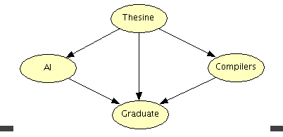
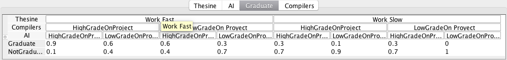
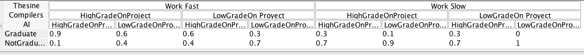
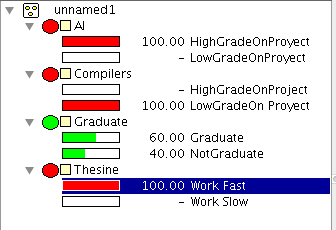
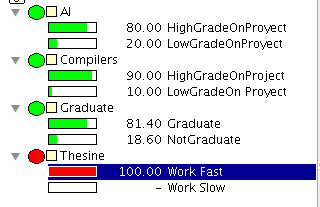

# Bayes report
#### Esteban Quintana A01184855
#### Javier Rodríguez A01152572

The model is based on the probabilites of Graduating/Not Graduating this semester given diferent proyect conditions of each subject.

## HUGIN LITE
<h3 style="color: red">Model</h3>


<h3 style="color: red">Probabilites</h3>
<br>
<br>
<br>
<br>
<h3 style="color: red">Tests</h3>
<br>
<br>

### Bayes implementation
```
> $ python3 bayes.py                                                    ⬡ 8.11.4 [±master ✓]
Thesine,AI,Compilers,Graduate
13
+Thesine=0.5
+AI|+Thesine=0.8
+AI|-Thesine=0.6
+Compilers|+Thesine=0.8
+Compilers|-Thesine=0.6
+Graduate|+Thesine,+Compilers,+AI=0.9
+Graduate|+Thesine,-Compilers,+AI=0.6
+Graduate|+Thesine,+Compilers,-AI=0.6
+Graduate|+Thesine,-Compilers,-AI=0.3
+Graduate|-Thesine,+Compilers,+AI=0.3
+Graduate|-Thesine,-Compilers,+AI=0.3
+Graduate|-Thesine,+Compilers,-AI=0.1
+Graduate|-Thesine,-Compilers,-AI=0.0
6
+AI
-Compilers
-Graduate|-Thesine,-Compilers,-AI
+Graduate|+Thesine,-Compilers,-AI
-Graduate|+Thesine,+Compilers,+AI
+Graduate|+Thesine,-Compilers,+AI
```
### Result Comparison
| Test| Result Hugin | Result Bayes |
| :---- | :----- | :----- |
| +AI  | 0.7 | 0.7 |
| -Compilers | 0.35 | 0.3 |
| -Graduate&#x7c;-Thesine,-Compilers,-AI | 1.0 | 1.0 |  
| +Graduate&#x7c;+Thesine,-Compilers,-AI | 0.3 | 0.3 |    
| -Graduate&#x7c;+Thesine,+Compilers,+AI | 0.1 | 0.1 |
| +Graduate&#x7c;+Thesine,-Compilers,+AI | 0.6 | 0.6 |

### Hugin Tests
| Category | Hugin Lite | Bayes implementation|
| :------ | :------ | :------ |
| User interface | Comprehensible interface | Command line|
| Queries 	 | Through tables, using a UML alike system, in which every node has attributes with certain probability | Receives nodes as strings and parse it through data structures |
| Intuition 	 | Easy to use because of the interface. It shows graphically how the probabilities interact	         | Straight forward, only one string output 			  |
| Cost 		 | Free, but includes more features when you pay for the complete version 				 | Free. Lots of hours of work. 		 		  |

### Questions
What are the differences between what they generate?
Nothing, they generate the same results. Only changes that Hugin has a graphic interface.
Do they use the same algorithms?
Yes, they both use Bayes networks to calculate its output.

Which tool would you use for what cases in real life applications?
We would personally use our python algorithm, because it could be used in a lot of cases as an external library, receiving different input cases and returning the outputs in a straight-forward way to complement other algorithms.

What are their common bases?
Both of them have the same base, they follow the rules to find the results in a Bayesian Probabilistic Network, and are able to provide accurate results according to the inputs.
